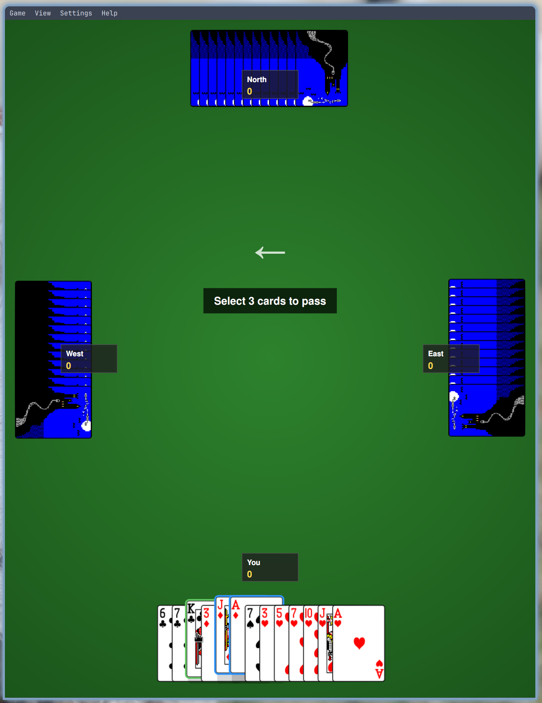

# Qt Hearts

A classic Hearts card game built with Qt6.



## Features

- Single player vs 3 AI opponents
- Three difficulty levels
- Card passing phases
- Undo support
- Sound effects
- Custom card themes (KDE carddeck compatible)
- Statistics tracking

## Installation

### Arch Linux (AUR)

```bash
yay -S qt-hearts
```

### From Source

**Dependencies:** Qt 6.x (Widgets, Svg, Multimedia, Quick), CMake 3.16+

```bash
cmake -B build -DCMAKE_BUILD_TYPE=Release -DCMAKE_INSTALL_PREFIX=/usr
cmake --build build
sudo cmake --install build
```

## Rules

- Avoid taking hearts (1 point each) and the Queen of Spades (13 points)
- Lowest score wins when any player reaches 100 points
- **Shoot the Moon:** Take all 26 points to give them to your opponents instead

## License

GPL-3.0
